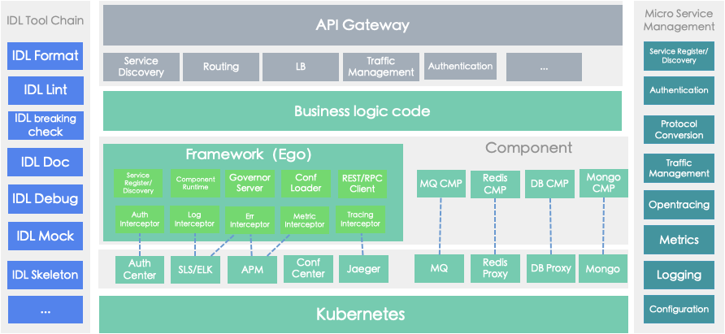
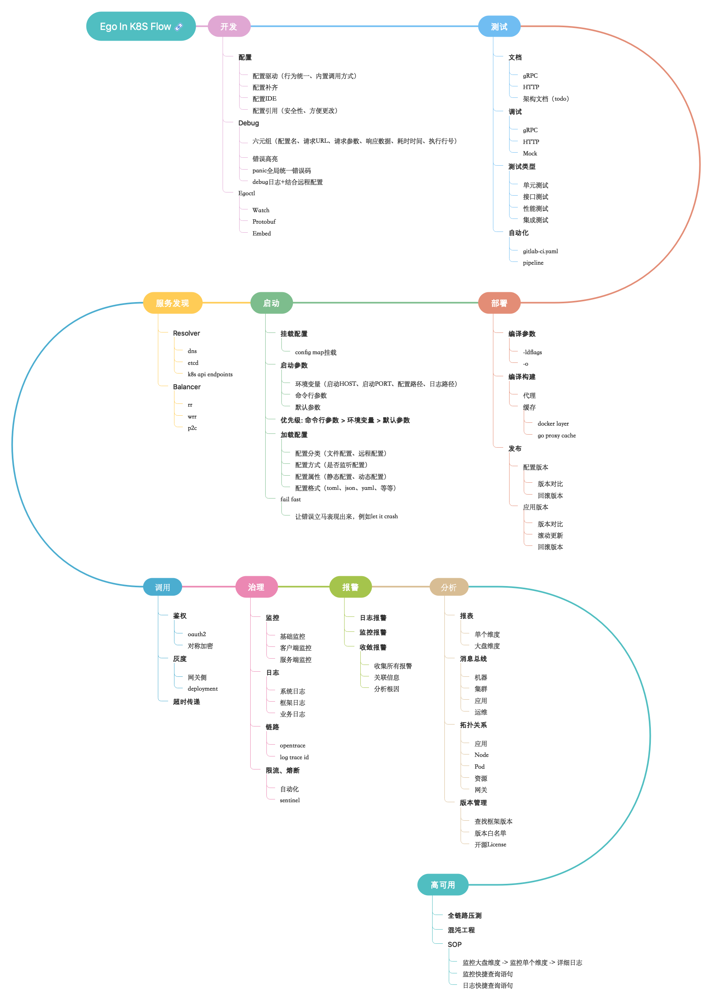
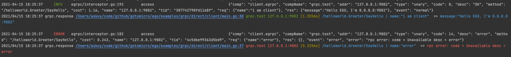
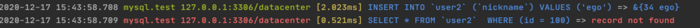
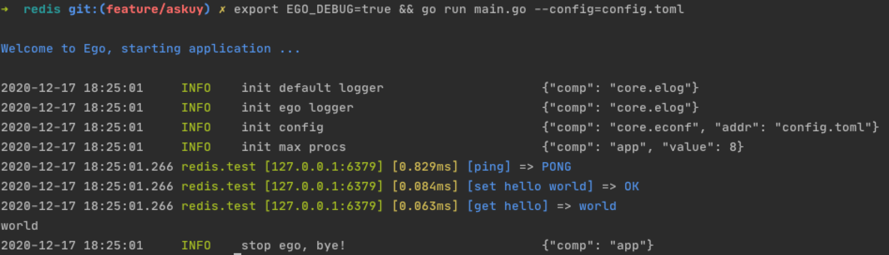
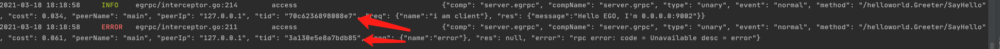
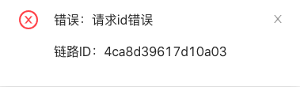
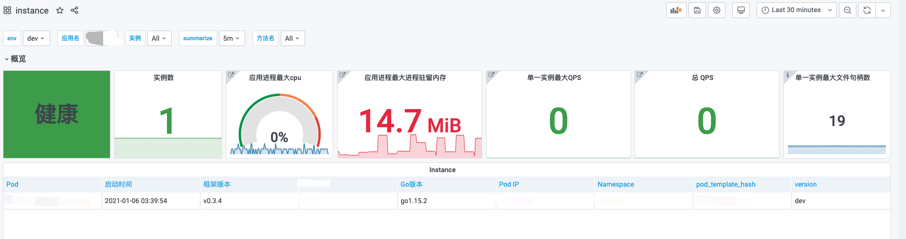
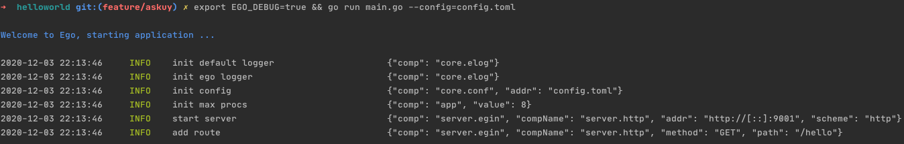
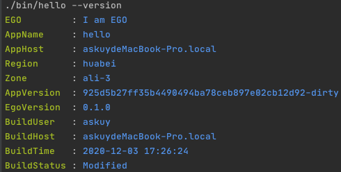

## EGO
[](#contributors-)
[](https://github.com/gotomicro/ego/actions)
[](https://goreportcard.com/report/github.com/gotomicro/ego)
[](https://codecov.io/gh/gotomicro/ego)
[](https://goproxy.cn/stats/github.com/gotomicro/ego)
[](https://github.com/gotomicro/ego)
[](https://opensource.org/licenses/MIT)
[](https://github.com/gotomicro/ego/tree/master/examples)
[](https://ego.gocn.vip)

## 1 帮助文档
[https://ego.gocn.vip](https://ego.gocn.vip)

## 2 介绍
EGO是一个集成里各种工程实践的框架。通过组件化的设计模式，保证了业务方能够统一的调用方式启动各种组件

使用EGO的优势
* 配置化驱动组件
* 屏蔽底层组件启动细节
* 微服务组件的可观测、可治理
* 可插拔的Ego-Component组件
* Fail Fast理念和错误友好提示

### 2.1 提升组件熟练度
我们工程师要想提升组件熟练度，首先要大量看开源组件文档和代码，然后坚持长时间使用，才能形成肌肉记忆，提升我们做业务的速度。而这一切所投入的时间和精力是非常大的。

要减少这个投入成本，让更多开发者使用好优秀的开源组件，EGO的做法是标准化所有开源组件，对其做一层封装，统一各种行为。
* 统一组件文件名
* 统一组件配置参数
* 统一组件调用API
* 统一组件错误行为
* 统一组件监控行为

让人掌握了一种组件，就可以举一反三使用其他组件。

### 2.2 提升故障排查效率
* 统一错误码
* 组件错误、慢响应、链路、常规请求拦截器埋点（服务端、客户端均会拦截）
* 收敛错误字段
* 注入组件关键信息：代码行号、配置名、目标地址、耗时、请求数据、响应数据
* 调试阶段，错误高亮、格式化友好提示
* 调试阶段，组件内置debug拦截器

### 2.3 自动生成重复代码
* 生成代码，配置、数据解析、模版分离
* 不依赖于语言，构建项目代码
* 利用Go1.16特性embed，启动web，生成代码
* 项目地址: [https://github.com/gotomicro/egoctl](https://github.com/gotomicro/egoctl)

## 3 Ego的组件
我们支持多种EGO组件，加快你的开发速度

| Component Name            | Code                                                                 | Example                                                                        | Doc                                                                                                                 |
|---------------------------|----------------------------------------------------------------------|--------------------------------------------------------------------------------|---------------------------------------------------------------------------------------------------------------------|
| HTTP Server               | [Code](https://github.com/gotomicro/ego/tree/master/server/egin)     | [Example](https://github.com/gotomicro/ego/tree/master/examples/server/http)   | [Doc](https://ego.gocn.vip/frame/server/http.html)                                                                  |
| gRPC Server               | [Code](https://github.com/gotomicro/ego/tree/master/server/egrpc)    | [Example](https://github.com/gotomicro/ego/tree/master/examples/server/grpc)   | [Doc](https://ego.gocn.vip/frame/server/grpc.html#example)                                                          |
| Governance Service        | [Code](https://github.com/gotomicro/ego/tree/master/server/egovernor) | [Example](https://github.com/gotomicro/ego/tree/master/examples/server/governor) | [Doc](https://ego.gocn.vip/frame/server/governor.html)                                                              |
| Job                       | [Code](https://github.com/gotomicro/ego/tree/master/task/ejob)       | [Example](https://github.com/gotomicro/ego/tree/master/examples/task/job)     | [Doc](https://ego.gocn.vip/frame/task/job.html)                                                                     |
| Corn job                  | [Code](https://github.com/gotomicro/ego/tree/master/task/ecron)      | [Example](https://github.com/gotomicro/ego/tree/master/examples/task/cron)     | [Doc](https://ego.gocn.vip/frame/task/cron.html#_3-%E5%B8%B8%E8%A7%84%E5%AE%9A%E6%97%B6%E4%BB%BB%E5%8A%A1)          |
| Distributed Scheduled Job | [Code](https://github.com/gotomicro/ego/tree/master/task/ecron)      | [Example](https://github.com/gotomicro/ego/tree/master/examples/task/cron)     | [Doc](https://ego.gocn.vip/frame/task/cron.html#_4-%E5%88%86%E5%B8%83%E5%BC%8F%E5%AE%9A%E6%97%B6%E4%BB%BB%E5%8A%A1) |
| HTTP Client               | [Code](https://github.com/gotomicro/ego/tree/master/client/ehttp)    | [Example](https://github.com/gotomicro/ego/tree/master/examples/http/client)   | [Doc](https://ego.gocn.vip/frame/client/http.html#example)                                                          |
| gRPC Client               | [Code](https://github.com/gotomicro/ego/tree/master/client/egrpc)    | [Example](https://github.com/gotomicro/ego/tree/master/examples/grpc/direct)   | [Doc](https://ego.gocn.vip/frame/client/grpc.html#_4-%E7%9B%B4%E8%BF%9Egrpc)                                        |
| gRPC Client using ETCD    | [Code](https://github.com/ego-component/tree/master/eetcd)           | [Example](https://github.com/ego-component/tree/master/eetcd/examples)         | [Doc](https://ego.gocn.vip/frame/client/grpc.html#_5-%E4%BD%BF%E7%94%A8etcd%E7%9A%84grpc)                           |
| gRPC Client using k8s     | [Code](https://github.com/ego-component/tree/master/ek8s)            | [Example](https://github.com/ego-component/tree/master/ek8s/examples)          | [Doc](https://ego.gocn.vip/frame/client/grpc.html#_6-%E4%BD%BF%E7%94%A8k8s%E7%9A%84grpc)                            |
| Sentinel                  | [Code](https://github.com/gotomicro/ego/tree/master/core/esentinel)  | [Example](https://github.com/gotomicro/ego/tree/master/examples/sentinel/http) | [Doc](https://ego.gocn.vip/frame/client/sentinel.html)                                                              |
| MySQL                     | [Code](https://github.com/ego-component/tree/master/egorm)           | [Example](https://github.com/ego-component/tree/master/egorm/examples)         | [Doc](https://ego.gocn.vip/frame/client/gorm.html#example)                                                          |
| Redis                     | [Code](https://github.com/ego-component/tree/master/eredis)          | [Example](https://github.com/ego-component/tree/master/eredis/examples)        | [Doc](https://ego.gocn.vip/frame/client/redis.html#example)                                                         |
| Redis Distributed lock    | [Code](https://github.com/ego-component/tree/master/eredis)          | [Example](https://github.com/ego-component/tree/master/eredis/examples)        | [Doc](https://ego.gocn.vip/frame/client/redis.html#example)                                                         |
| Mongo                     | [Code](https://github.com/ego-component/tree/master/emongo)          | [Example](https://github.com/ego-component/tree/master/emongo/examples)        | [Doc](https://ego.gocn.vip/frame/client/mongo.html)                                                                 |
| Kafka                     | [Code](https://github.com/ego-component/tree/master/ekafka)          | [Example](https://github.com/ego-component/tree/master/ekafka/examples)        | [Doc](https://ego.gocn.vip/frame/client/kafka.html)                                                                 |
| ETCD                      | [Code](https://github.com/ego-component/tree/master/eetcd)           | [Example](https://github.com/ego-component/tree/master/eetcd/examples)         | [Doc](https://ego.gocn.vip/frame/client/eetcd.html)                                                                 |
| K8S                       | [Code](https://github.com/ego-component/tree/master/ek8s)            | [Example](https://github.com/ego-component/tree/master/ek8s/examples)          | [Doc](https://ego.gocn.vip/frame/client/ek8s.html)                                                                  |
| Oauth2                    | [Code](https://github.com/ego-component/tree/master/eoauth2)         | [Example](https://github.com/ego-component/tree/master/eoauth2/examples)       ||

* 更多组件请查看:[https://github.com/ego-component](https://github.com/ego-component)


## 4 EGO的定义
### 4.1 框架分层
我们框架分为三个层次
* 核心层提供配置、日志、监控和链路，是其他组件的基石
* 组件层提供客户端、服务端、任务端里的各种组件
* 胶水层控制了各种组件的生命周期，错误处理

### 4.2 架构图


### 4.3 生命周期


### 4.4 组件分层
我们认为一切均是组件，我们将组件分为四个部分：
- Container 处理组件类型、组件配置、组件启动
- Config    配置参数
- Component 组件的调用方法
- Options   配置和组件可选项

## 5 版本要求
* v0.8.2以下  需要 go大于go1.13
* v0.8.3后   需要 go大于go1.16
* v1.0.0后   需要 go大于go1.17

## 6 下载工具
```bash
bash <(curl -L https://raw.githubusercontent.com/gotomicro/egoctl/main/getlatest.sh)
```
通过以上脚本，可以下载protoc工具全家桶，以及ego的protoc插件和egoctl
* /usr/local/bin/egoctl               EGO工具 
* /usr/local/bin/protoc               生成Pb工具
* /usr/local/bin/protoc-gen-go        生成Pb工具
* /usr/local/bin/protoc-gen-go-grpc   生成gRPC工具
* /usr/local/bin/protoc-gen-go-errors 生成错误码工具
* /usr/local/bin/protoc-gen-openapiv2 生成HTTP工具
* /usr/local/bin/protoc-gen-go-http   生成HTTP工具


## 7 特性介绍
* 配置驱动
  所有组件启动方式为`组件名称.Load("配置名称").Build()`，可以创建一个组件实例。如以下`http server`，`egin`是组件名称，`server.http`是配置名称
```go
egin.Load("server.http").Build()
```
* 友好的debug
  通过开启``debug``配置和命令行的``export EGO_DEBUG=true``，
  我们可以在测试环境里看到所有组件的请求里的行号、配置名、请求地址、耗时、请求数据、响应数据






并且使用``Goland``同学，可以直接通过行号点击到对应的代码路径(gRPC、HTTP客户端支持行号)

* 链路
  使用opentrace协议，自动将链路加入到日志里
    * gRPC链路
        * 测试代码
          [gRPC直连查看链路id](https://github.com/gotomicro/ego/tree/master/examples/grpc/direct)
        * 服务端链路信息

      
        * 客户端链路信息

      
    * HTTP链路

      

* [统一的错误信息](https://ego.gocn.vip/awesome/errors.html)

* 统一的监控信息



## 8 Quick Start

### 8.1 HelloWorld
配置

```toml
[server.http]
    port = 9001
    host = "0.0.0.0"
```
代码

```go
package main
import (
   "github.com/gin-gonic/gin"
   "github.com/gotomicro/ego"
   "github.com/gotomicro/ego/core/elog"
   "github.com/gotomicro/ego/server"
   "github.com/gotomicro/ego/server/egin"
)
//  export EGO_DEBUG=true && go run main.go --config=config.toml
func main() {
   if err := ego.New().Serve(func() *egin.Component {
      server := egin.Load("server.http").Build()
      server.GET("/hello", func(ctx *gin.Context) {
         ctx.JSON(200, "Hello EGO")
         return
      })
      return server
   }()).Run(); err != nil {
      elog.Panic("startup", elog.FieldErr(err))
   }
}
```

### 8.2 使用命令行运行
```
export EGO_DEBUG=true # 默认日志输出到logs目录，开启dev后日志输出到终端
go run main.go --config=config.toml
```

### 8.3 如下所示



这个时候我们可以发送一个指令，得到如下结果
```
➜  helloworld git:(master) ✗ curl http://127.0.0.1:9001/hello
"Hello Ego"%  
```

### 8.4 更加友好的包编译

使用scripts文件夹里的[包编译](examples/build)，可以看到优雅的version提示



## 9 更新日志
[Releases](https://github.com/gotomicro/ego/releases)

## 10 加入我们
加入我们，请在验证信息里添加``ego``关键字


## Contributors

Thanks for these wonderful people:

<!-- ALL-CONTRIBUTORS-LIST:START - Do not remove or modify this section -->
<!-- prettier-ignore-start -->
<!-- markdownlint-disable -->
<table>
  <tr>
    <td align="center"><a href="https://github.com/askuy"><br /><sub><b>askuy</b></sub></a></td>
    <td align="center"><a href="https://github.com/sevennt"><br /><sub><b>Wei Zheng</b></sub></a></td>
    <td align="center"><a href="https://zhuanlan.zhihu.com/c_1209048962315108352"><br /><sub><b>shaoyuan</b></sub></a></td>
    <td align="center"><a href="https://wujunze.com/"><br /><sub><b>Panda</b></sub></a></td>
    <td align="center"><a href="https://github.com/NeoyeElf"><br /><sub><b>刘文哲</b></sub></a></td>
    <td align="center"><a href="https://github.com/zhjunjun"><br /><sub><b>zhangjunjun</b></sub></a></td>
    <td align="center"><a href="https://github.com/devincd"><br /><sub><b>devincd</b></sub></a></td>
  </tr>
  <tr>
    <td align="center"><a href="https://www.jianshu.com/u/f2b47e5528d8"><br /><sub><b>Ming Deng</b></sub></a></td>
    <td align="center"><a href="https://github.com/cute-angelia"><br /><sub><b>Angelia</b></sub></a></td>
    <td align="center"><a href="https://www.yuque.com/wbofeng"><br /><sub><b>Wbofeng</b></sub></a></td>
    <td align="center"><a href="https://github.com/clannadxr"><br /><sub><b>clannadxr</b></sub></a></td>
    <td align="center"><a href="https://www.duanlv.ltd"><br /><sub><b>Link Duan</b></sub></a></td>
    <td align="center"><a href="https://cqs.es"><br /><sub><b>Costa</b></sub></a></td>
    <td align="center"><a href="https://kl7sn.github.io"><br /><sub><b>MEX7</b></sub></a></td>
  </tr>
  <tr>
    <td align="center"><a href="http://blog.lincolnzhou.com/"><br /><sub><b>LincolnZhou</b></sub></a></td>
    <td align="center"><a href="https://github.com/optimistic9527"><br /><sub><b>optimistic9527</b></sub></a></td>
    <td align="center"><a href="https://github.com/livepo"><br /><sub><b>soeluc</b></sub></a></td>
  </tr>
</table>

<!-- markdownlint-restore -->
<!-- prettier-ignore-end -->

<!-- ALL-CONTRIBUTORS-LIST:END -->

