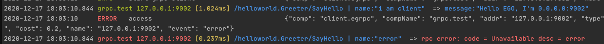

## EGO
[](https://github.com/gotomicro/ego/actions)
[](https://goreportcard.com/report/github.com/gotomicro/ego)
[](https://codecov.io/gh/gotomicro/ego)
[](https://goproxy.cn/stats/github.com/gotomicro/ego)
[](https://github.com/gotomicro/ego)
[](https://opensource.org/licenses/MIT)

## 1 帮助文档
[https://ego.gocn.vip](https://ego.gocn.vip)

## 2 介绍
EGO是一个集成里各种工程实践的框架。通过组件化的设计模式，保证了业务方能够统一的调用方式启动各种组件

使用EGO的优势
* 配置化驱动组件
* 屏蔽底层组件启动细节
* 微服务组件的可观测、可治理
* 可插拔的Ego-Component组件
* Fail Fast理念和错误友好提示

### 2.1 提升组件熟练度
我们工程师要想提升组件熟练度，首先要大量看开源组件文档和代码，然后坚持长时间使用，才能形成肌肉记忆，提升我们做业务的速度。而这一切所投入的时间和精力是非常大的。

要减少这个投入成本，让更多开发者使用好优秀的开源组件，EGO的做法是标准化所有开源组件，对其做一层封装，统一各种行为。
* 统一组件文件名
* 统一组件配置参数
* 统一组件调用API
* 统一组件错误行为
* 统一组件监控行为
让人掌握了一种组件，就可以举一反三使用其他组件。

### 2.2 提升故障排查效率
* 统一错误码
* 组件错误、慢响应、链路、常规请求拦截器埋点（服务端、客户端均会拦截）
* 收敛错误字段
* 注入组件关键信息、包名、配置名、地址等
* 调试阶段，错误高亮、格式化友好提示
* 调试阶段，组件内置debug拦截器

### 2.3 自动生成重复代码
* 生成代码，配置、数据解析、模版分离
* 不依赖于语言，构建项目代码
* 利用Go1.16特性embed，启动web，生成代码
* 项目地址: [https://github.com/gotomicro/egoctl](https://github.com/gotomicro/egoctl)

## 3 EGO的定义
### 3.1 框架分层
我们框架分为三个层次
* 核心层提供配置、日志、监控和链路，是其他组件的基石
* 组件层提供客户端、服务端、任务端里的各种组件
* 胶水层控制了各种组件的生命周期，错误处理


### 3.2 组件分层
我们认为一切均是组件，我们将组件分为四个部分：
- Container 处理组件类型、组件配置、组件启动
- Config    配置参数
- Component 组件的调用方法
- Options   配置和组件可选项


## 4 功能
|组件名称|代码|例子|文档|
| --- | --- | --- | --- |
|HTTP服务|[代码](./server/egin)|[例子](./examples/server/http)|[文档](https://ego.gocn.vip/frame/server/http.html)|
|gRPC服务|[代码](./server/egrpc)|[例子](./examples/server/grpc)|[文档](https://ego.gocn.vip/frame/server/grpc.html#example)|
|治理服务|[代码](./server/egovernor)|[例子](./examples/server/governor)|[文档](https://ego.gocn.vip/frame/server/governor.html)|
|短时任务|[代码](./task/ejob)|[例子](./examples/task/job)|[文档](https://ego.gocn.vip/frame/task/job.html)|
|常规定时任务|[代码](./task/ecron)|[例子](./examples/task/job)|[文档](https://ego.gocn.vip/frame/task/cron.html#_3-%E5%B8%B8%E8%A7%84%E5%AE%9A%E6%97%B6%E4%BB%BB%E5%8A%A1)|
|分布式定时任务|||[文档](https://ego.gocn.vip/frame/task/cron.html#_4-%E5%88%86%E5%B8%83%E5%BC%8F%E5%AE%9A%E6%97%B6%E4%BB%BB%E5%8A%A1)|
|调用HTTP|[代码](./client/ehttp)|[例子](./examples/http/client)|[文档](https://ego.gocn.vip/frame/client/http.html#example)|
|直连调用gRPC|[代码](./client/egrpc)|[例子](./examples/grpc/direct)|[文档](https://ego.gocn.vip/frame/client/grpc.html#_4-%E7%9B%B4%E8%BF%9Egrpc)|
|通过etcd调用gRPC||[例子](https://github.com/gotomicro/ego-component/tree/master/eetcd/examples)|[文档](https://ego.gocn.vip/frame/client/grpc.html#_5-%E4%BD%BF%E7%94%A8etcd%E7%9A%84grpc)|
|通过k8s调用gRPC||[例子](https://github.com/gotomicro/ego-component/tree/master/eetcd/examples)|[文档](https://ego.gocn.vip/frame/client/grpc.html#_6-%E4%BD%BF%E7%94%A8k8s%E7%9A%84grpc)|
|调用MySQL|[代码](https://github.com/gotomicro/ego-component/tree/master/egorm)|[例子](https://github.com/gotomicro/ego-component/tree/master/egorm/examples/gorm)|[文档](https://ego.gocn.vip/frame/client/gorm.html#example)|
|调用Redis|[代码](https://github.com/gotomicro/ego-component/tree/master/eredis)|[例子](https://github.com/gotomicro/ego-component/tree/master/eredis/examples/redis)|[文档](https://ego.gocn.vip/frame/client/redis.html#example)|
|调用Redis分布式锁|[代码](https://github.com/gotomicro/ego-component/tree/master/eredis)||｜
|调用Mongo|[代码](https://github.com/gotomicro/ego-component/tree/master/emongo)|||
|调用Kafka|[代码](https://github.com/gotomicro/ego-component/tree/master/ekafka)|||
|调用ETCD|[代码](https://github.com/gotomicro/ego-component/tree/master/eetcd)|||
|调用K8S|[代码](https://github.com/gotomicro/ego-component/tree/master/ek8s)|||
|调用Oauth2|[代码](https://github.com/gotomicro/ego-component/tree/master/eoauth2)|||
|调用Wechat|[代码](https://github.com/gotomicro/ego-component/tree/master/ewechat)|||
|调用Dingtalk|[代码](https://github.com/gotomicro/ego-component/tree/master/edingtalk)|||
|调用Jira|[代码](https://github.com/gotomicro/ego-component/tree/master/ejira)|||

* 更多组件请查看:[https://github.com/gotomicro/ego-component](https://github.com/gotomicro/ego-component)


## 5 特性介绍
* 配置驱动
所有组件启动方式为`组件名称.Load("配置名称").Build()`，可以创建一个组件实例。如以下`http server`，`egin`是组件名称，`server.http`是配置名称
```go
egin.Load("server.http").Build()
```
* 友好的debug
可以看到所有组件的请求参数和响应参数信息




* 链路
使用opentrace协议，自动将链路加入到日志里


* [统一的错误信息](https://ego.gocn.vip/awesome/errors.html)
* 统一的监控信息      


    
## 6 Quick Start

### 6.1 HelloWorld
```package main
import (
   "github.com/gin-gonic/gin"
   "github.com/gotomicro/ego"
   "github.com/gotomicro/ego/core/elog"
   "github.com/gotomicro/ego/server"
   "github.com/gotomicro/ego/server/egin"
)
//  export EGO_DEBUG=true && go run main.go --config=config.toml
func main() {
   if err := ego.New().Serve(func() *egin.Component {
      server := egin.Load("server.http").Build()
      server.GET("/hello", func(ctx *gin.Context) {
         ctx.JSON(200, "Hello EGO")
         return
      })
      return server
   }()).Run(); err != nil {
      elog.Panic("startup", elog.FieldErr(err))
   }
}
```

### 6.2 使用命令行运行
```
export EGO_DEBUG=true # 默认日志输出到logs目录，开启dev后日志输出到终端
go run main.go --config=config.toml
```

### 6.3 如下所示


这个时候我们可以发送一个指令，得到如下结果
```
➜  helloworld git:(master) ✗ curl http://127.0.0.1:9001/hello
"Hello Ego"%  
```

### 6.4 更加友好的包编译

使用scripts文件夹里的[包编译](examples/build)，可以看到优雅的version提示

