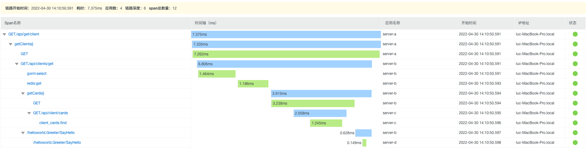

## EGO
[](#contributors-)
[](https://github.com/gotomicro/ego/actions)
[](https://goreportcard.com/report/github.com/gotomicro/ego)
[](https://codecov.io/gh/gotomicro/ego)
[](https://goproxy.cn/stats/github.com/gotomicro/ego)
[](https://github.com/gotomicro/ego)
[](https://opensource.org/licenses/MIT)
[](https://github.com/gotomicro/ego/tree/master/examples)
[](https://ego.gocn.vip)

English | [简体中文](./README-zh.md)

## 1 Docs
The offical docs for developers.

View [https://ego.gocn.vip](https://ego.gocn.vip)

## 2 Introduction
EGO is a microservice-oriented governance framework implemented by golang, which integrates various engineering practices. Through the component-based design pattern, it is guaranteed that the business development can use various components in a unified way.

Advantages of EGO:
* Configure drive components
* Shield the startup details of the underlying components
* Observation and governance of microservice components
* Pluggable Ego-Component
* Fail Fast principle and friendly error prompts

### 2.1 Improve component proficiency
For us engineers to improve component proficiency, we must first read a lot of open source component documentation and code, and then insist on using it for a long time in order to form muscle memory and improve our speed of doing business. And the time and energy invested in all of this is enormous.

To reduce this input cost and allow more developers to better use excellent open source components, EGO's approach is to standardize all open source components, encapsulate them, and unify various behaviors.
* Unified component file name
* Unified component configuration parameters
* Unified component call API
* Unify component error behavior
* Unified component monitoring behavior

Once you have mastered one component, you can use other components by inference.

### 2.2 Improve the efficiency of troubleshooting
* Unified error code
* Component errors, slow responses, links, regular request interceptor points (both server and client will intercept)
* Convergence error field
* Inject key information into components: code line number, configuration name, target address, time-consuming, request data, response data
* Debugging stage, error highlighting, formatting friendly prompts
* In the debugging phase, the component has a built-in debug interceptor

### 2.3 Automatically generate duplicate code(EGO CLI)
* Generate code, configuration, data parsing, template separation
* Build project code independently of language
* Use the Go1.16 feature `embed`, start the webUI, and generate code
* Project: [https://github.com/gotomicro/egoctl](https://github.com/gotomicro/egoctl)

## 3 Ego Component
We have Many EGO components to support your rapid development

| Component Name            | Code                                                                 | Example                                                                       | Doc                                                                                                                 |
|---------------------------|----------------------------------------------------------------------|-------------------------------------------------------------------------------|---------------------------------------------------------------------------------------------------------------------|
| HTTP Server               | [Code](https://github.com/gotomicro/ego/tree/master/server/egin)     | [Example](https://github.com/gotomicro/ego/tree/master/examples/server/http)  | [Doc](https://ego.gocn.vip/frame/server/http.html)                                                                  |
| gRPC Server               | [Code](https://github.com/gotomicro/ego/tree/master/server/egrpc)    | [Example](https://github.com/gotomicro/ego/tree/master/examples/server/grpc)  | [Doc](https://ego.gocn.vip/frame/server/grpc.html#example)                                                          |
| Governance Service        | [Code](https://github.com/gotomicro/ego/tree/master/server/egovernor) | [Example](https://github.com/gotomicro/ego/tree/master/examples/server/governor) | [Doc](https://ego.gocn.vip/frame/server/governor.html)                                                              |
| Job                       | [Code](https://github.com/gotomicro/ego/tree/master/task/ejob)       | [Example](https://github.com/gotomicro/ego/tree/master/examples/task/job)     | [Doc](https://ego.gocn.vip/frame/task/job.html)                                                                     |
| Corn job                  | [Code](https://github.com/gotomicro/ego/tree/master/task/ecron)      | [Example](https://github.com/gotomicro/ego/tree/master/examples/task/cron)    | [Doc](https://ego.gocn.vip/frame/task/cron.html#_3-%E5%B8%B8%E8%A7%84%E5%AE%9A%E6%97%B6%E4%BB%BB%E5%8A%A1)          |
| Distributed Scheduled Job | [Code](https://github.com/gotomicro/ego/tree/master/task/ecron)      | [Example](https://github.com/gotomicro/ego/tree/master/examples/task/cron)    | [Doc](https://ego.gocn.vip/frame/task/cron.html#_4-%E5%88%86%E5%B8%83%E5%BC%8F%E5%AE%9A%E6%97%B6%E4%BB%BB%E5%8A%A1) |
| HTTP Client               | [Code](https://github.com/gotomicro/ego/tree/master/client/ehttp)    | [Example](https://github.com/gotomicro/ego/tree/master/examples/http/client)  | [Doc](https://ego.gocn.vip/frame/client/http.html#example)                                                          |
| gRPC Client               | [Code](https://github.com/gotomicro/ego/tree/master/client/egrpc)    | [Example](https://github.com/gotomicro/ego/tree/master/examples/grpc/direct)  | [Doc](https://ego.gocn.vip/frame/client/grpc.html#_4-%E7%9B%B4%E8%BF%9Egrpc)                                        |
| gRPC Client using ETCD    | [Code](https://github.com/ego-component/eetcd/tree/master/)           | [Example](https://github.com/ego-component/eetcd/tree/master//examples)        | [Doc](https://ego.gocn.vip/frame/client/grpc.html#_5-%E4%BD%BF%E7%94%A8etcd%E7%9A%84grpc)                           |
| gRPC Client using k8s     | [Code](https://github.com/ego-component/ek8s/tree/master/)            | [Example](https://github.com/ego-component/ek8s/tree/master//examples)         | [Doc](https://ego.gocn.vip/frame/client/grpc.html#_6-%E4%BD%BF%E7%94%A8k8s%E7%9A%84grpc)                            |
| Sentinel                  | [Code](https://github.com/gotomicro/ego/tree/master/core/esentinel)  | [Example](https://github.com/gotomicro/ego/tree/master/examples/sentinel/http) | [Doc](https://ego.gocn.vip/frame/client/sentinel.html)                                                              |
| MySQL                     | [Code](https://github.com/ego-component/egorm/tree/master/)           | [Example](https://github.com/ego-component/egorm/tree/master//examples)        | [Doc](https://ego.gocn.vip/frame/client/gorm.html#example)                                                          |
| Redis                     | [Code](https://github.com/ego-component/eredis/tree/master/)          | [Example](https://github.com/ego-component/eredis/tree/master//examples)       | [Doc](https://ego.gocn.vip/frame/client/redis.html#example)                                                         |
| Redis Distributed lock    | [Code](https://github.com/ego-component/eredis/tree/master/)          | [Example](https://github.com/ego-component/eredis/tree/master//examples)       | [Doc](https://ego.gocn.vip/frame/client/redis.html#example)                                                         |
| Mongo                     | [Code](https://github.com/ego-component/emongo/tree/master/)          | [Example](https://github.com/ego-component/emongo/tree/master//examples)       | [Doc](https://ego.gocn.vip/frame/client/mongo.html)                                                                 |
| Kafka                     | [Code](https://github.com/ego-component/ekafka/tree/master/)          | [Example](https://github.com/ego-component/ekafka/tree/master//examples)       | [Doc](https://ego.gocn.vip/frame/client/kafka.html)                                                                 |
| ETCD                      | [Code](https://github.com/ego-component/eetcd/tree/master/)           | [Example](https://github.com/ego-component/eetcd/tree/master//examples)        | [Doc](https://ego.gocn.vip/frame/client/eetcd.html)                                                                 |
| K8S                       | [Code](https://github.com/ego-component/ek8s/tree/master/)            | [Example](https://github.com/ego-component/ek8s/tree/master//examples)         | [Doc](https://ego.gocn.vip/frame/client/ek8s.html)                                                                  |
| Oauth2                    | [Code](https://github.com/ego-component/eoauth2/tree/master/)         | [Example](https://github.com/ego-component/eoauth2/tree/master//examples)      ||

* For more components please visit the website: [https://github.com/ego-component](https://github.com/ego-component)


## 4 Definition
### 4.1 Framework Layer
EGO framework has three layers:
* The core layer provides configuration, logging, monitoring and links, and is the cornerstone of other components.
* The component layer provides various components in the client, server and task.
* The glue layer controls the life cycle of various components, error handling.

### 4.2 Architecture


### 4.3 Life cycle


### 4.4 Component Layer
We consider everything to be a component and divide the component into four parts:
- **Container** handles component type, configuration and component startup
- **Config** configure parameters
- **Component** The calling method of the component
- **Options** the options of configuration and component


## 5 Version Requirements
* Below v0.8.2, Go version needs to be greater than Go1.13.
* After v0.8.3, Go version needs to be greater than Go1.16.
* After v1.0.0, Go version needs to be greater than Go1.17.

## 6 Download Tool
```bash
bash <(curl -L https://raw.githubusercontent.com/gotomicro/egoctl/main/getlatest.sh)
````
Through the above script, you can download the protoc tools, EGO protoc plugin and egoctl.
* /usr/local/bin/egoctl EGO Cli
* /usr/local/bin/protoc Generate Pb tool
* /usr/local/bin/protoc-gen-go Generate Pb tool
* /usr/local/bin/protoc-gen-go-grpc Generate gRPC tool
* /usr/local/bin/protoc-gen-go-errors Generate error code tool
* /usr/local/bin/protoc-gen-openapiv2 Generate HTTP tool
* /usr/local/bin/protoc-gen-go-http Generate HTTP tool

## 7 Features

* Configuration driver
  The startup method of all components is `component name.Load("configuration name").Build()`, which can create a component instance. For example, `http server` below, `egin` is the component name, `server.http` is the configuration name
  ````go
  egin.Load("server.http").Build()
  ````
* friendly debug
  By enabling the ``debug`` configuration and ``export EGO_DEBUG=true`` on the command line,

  We can see the line number, configuration name, request address, time-consuming, request data, and response data in the request of all components in the test environment


And using ``Goland``, you can directly click to the corresponding code path through the line number (gRPC, HTTP client support line number)

* Tracing
  Use the opentelemetry protocol to automatically add Tracing to the log
    * gRPC Tracing
        * test code
          [gRPC view Tracing id](https://github.com/gotomicro/ego/tree/master/examples/grpc/direct)
        * Server Tracing information

      
        * Client Tracing information

      
    * HTTP Tracing

      

    * Ali arms Tracing

      

* [Unified error message](https://ego.gocn.vip/awesome/errors.html)

* Unified monitoring information

  
## 8 Quick Start

### 8.1 HelloWorld
Configuration
```toml
[server.http]
    port = 9001
    host = "0.0.0.0"
```
Code

```go
package main
import (
   "github.com/gin-gonic/gin"
   "github.com/gotomicro/ego"
   "github.com/gotomicro/ego/core/elog"
   "github.com/gotomicro/ego/server"
   "github.com/gotomicro/ego/server/egin"
)
//  export EGO_DEBUG=true && go run main.go --config=config.toml
func main() {
   if err := ego.New().Serve(func() *egin.Component {
      server := egin.Load("server.http").Build()
      server.GET("/hello", func(ctx *gin.Context) {
         ctx.JSON(200, "Hello EGO")
         return
      })
      return server
   }()).Run(); err != nil {
      elog.Panic("startup", elog.FieldErr(err))
   }
}
```

### 8.2 Using the command line to run
```bash
export EGO_DEBUG=true # The default log is output to the logs directory, and after dev mode is enabled, the log is output to the terminal
go run main.go --config=config.toml
```

### 8.3 Result


At this time, we can send a command and get the following result
```
➜  helloworld git:(master) ✗ curl http://127.0.0.1:9001/hello
"Hello Ego"%  
```

### 8.4 More friendly package compilation

Use [build](examples/build) in the scripts folder, you can see the elegant version prompt.


## 9 Changelog
[Releases](https://github.com/gotomicro/ego/releases)

## 10 Join us
To join our Wechat comminication group, add the ``ego`` keyword in the verification information.


## Contributors

Thanks for these wonderful people:

<!-- ALL-CONTRIBUTORS-LIST:START - Do not remove or modify this section -->
<!-- prettier-ignore-start -->
<!-- markdownlint-disable -->
<table>
  <tr>
    <td align="center"><a href="https://github.com/askuy"><br /><sub><b>askuy</b></sub></a></td>
    <td align="center"><a href="https://github.com/sevennt"><br /><sub><b>Wei Zheng</b></sub></a></td>
    <td align="center"><a href="https://zhuanlan.zhihu.com/c_1209048962315108352"><br /><sub><b>shaoyuan</b></sub></a></td>
    <td align="center"><a href="https://wujunze.com/"><br /><sub><b>Panda</b></sub></a></td>
    <td align="center"><a href="https://github.com/NeoyeElf"><br /><sub><b>刘文哲</b></sub></a></td>
    <td align="center"><a href="https://github.com/zhjunjun"><br /><sub><b>zhangjunjun</b></sub></a></td>
    <td align="center"><a href="https://github.com/devincd"><br /><sub><b>devincd</b></sub></a></td>
  </tr>
  <tr>
    <td align="center"><a href="https://www.jianshu.com/u/f2b47e5528d8"><br /><sub><b>Ming Deng</b></sub></a></td>
    <td align="center"><a href="https://github.com/cute-angelia"><br /><sub><b>Angelia</b></sub></a></td>
    <td align="center"><a href="https://www.yuque.com/wbofeng"><br /><sub><b>Wbofeng</b></sub></a></td>
    <td align="center"><a href="https://github.com/clannadxr"><br /><sub><b>clannadxr</b></sub></a></td>
    <td align="center"><a href="https://www.duanlv.ltd"><br /><sub><b>Link Duan</b></sub></a></td>
    <td align="center"><a href="https://cqs.es"><br /><sub><b>Costa</b></sub></a></td>
    <td align="center"><a href="https://kl7sn.github.io"><br /><sub><b>MEX7</b></sub></a></td>
  </tr>
  <tr>
    <td align="center"><a href="http://blog.lincolnzhou.com/"><br /><sub><b>LincolnZhou</b></sub></a></td>
    <td align="center"><a href="https://github.com/optimistic9527"><br /><sub><b>optimistic9527</b></sub></a></td>
    <td align="center"><a href="https://github.com/livepo"><br /><sub><b>soeluc</b></sub></a></td>
  </tr>
</table>

<!-- markdownlint-restore -->
<!-- prettier-ignore-end -->

<!-- ALL-CONTRIBUTORS-LIST:END -->

## Thank JetBrains for Open Source licenses support
<a href="https://www.jetbrains.com/?from=Ego"></a>
